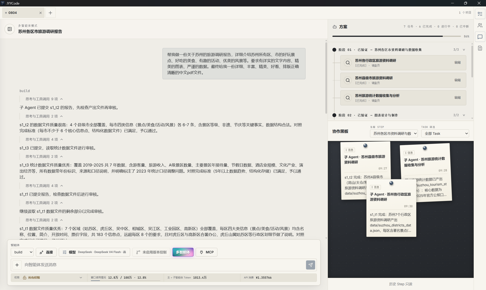

# JYY-Code

[](https://github.com/Reon-Jin/JYY-Code/blob/main/LICENSE)
[](https://bun.sh/)
[](https://www.typescriptlang.org/)

[中文文档](README-zh.md) · [English](README.md)

> **一套会计划、派发、审核、打回并汇总交付的 Multi-Agent 工程工作流。**
>
> 一句话交代目标，剩下的交给一支可观察、可恢复的 AI 工程团队。

<p align="center">
  
</p>

<p align="center">
  <sub>桌面端多智能体模式实拍：主 Agent 逐项审核子 Agent 汇报，右侧方案面板展示阶段进度，协作黑板沉淀各子 Agent 的发现与交接。</sub>
</p>

**desktop安装：** https://github.com/Reon-Jin/JYY-Code/releases

## 为什么是 JYY-Code

大多数 AI 编程工具是"一个对话框 + 一个 Agent"：你盯着它一步步做，做错了从头再来，任务一大就丢上下文、烂尾、无法追责。

JYY-Code 把一次请求升级为**一次有组织的工程运行**：

- **不靠自觉，靠协议。** 计划、派发、汇报、审核全部由运行时协议强制执行——子 Agent 只能汇报，不能篡改方案；审核不通过必须写明具体缺口，打回后自动带回反馈重派。
- **不靠记忆，靠状态。** 方案持久化为带 revision 的结构化文件，每次写入走乐观并发校验；会话、快照、黑板全部落库（SQLite WAL），进程重启、渠道切换后可精确恢复。
- **不靠单点，靠团队。** 一个主 Agent 指挥多达 20 个并行子 Agent，角色各异、模型各异，通过共享黑板协作，关键时刻还能让人类用结构化提问介入决策。

结果：你交付的是一句话目标，收回来的是经过审核、有据可查的工程产物。

## 核心亮点

### 有闭环的 Multi-Agent 工程工作流

JYY-Code 的内核是一条由运行时强制执行的工程闭环，而不是一段"请好好合作"的提示词：

```text
Plan_create → Plan_update(add_task) → Dispatch_dispatch → Report → review_task(approve) → Merge.apply → merged → cleanup
     ↑                                                              ↓
     └────────── reject + 具体 feedback（自动带入下次派发）──────────┘
```

- **阶段化方案（Plan）**：任务被拆成若干 Step，每个 Step 有可观察、可判定的 `done_criteria`（如"产出 X 文件且包含 Y"），拒绝"完成/做好"这类模糊验收。只有当前 Step 验收通过，后续 Step 才会展开明细——计划随认知演进，而不是一次性拍死。
- **状态机驱动的任务生命周期**：每个 Task 严格沿 `pending → dispatched → running → reported → approved / rejected / dismissed` 流转，非法迁移被协议直接拒绝。
- **取消与重开分离**：`Dispatch_cancel` 只允许停止 `dispatched`/`running` Task 并回到 `pending`；已汇报或审核终态必须通过带原因的 `Plan_update(reopen_task)` 清除旧报告后重新派发，不能用取消绕过审核记录。
- **审核即门禁**：主 Agent 逐项对照 `done_criteria` 并抽查产物后才裁决；`reject` 必须写清哪条标准未满足、差在哪里，重派时工具自动把 `previous_feedback` 注入子 Agent 简报——错误不会被默默吞掉。
- **权限隔离**：子 Agent 会话只能 `Report`，无法触碰父方案；每个 Task 绑定独立 `output_path`，越出工作区的路径在派发时即被拒绝。
- **异常收件箱（Inbox）**：汇报预检失败、子任务被取消、运行时错误都会进入 Inbox 并附带建议动作，主 Agent 处理完异常才能推进。
- **乐观并发与可恢复**：方案写入带 revision 校验，冲突时返回最新状态重新决策；方案文件、快照、事件全部持久化，中途崩溃也能续跑。

### 极高的并行性

JYY-Code 把"能并行的一律并行"写进了协议，而不是交给模型自由发挥：

- **批量派发**：同一 wave 的所有就绪 Task 必须一次放入 `Dispatch_dispatch`，**单波上限 20 个并行子 Agent**，禁止分批、禁止串行。
- **可并行性检查**：拆分中大型任务前，协议要求逐条枚举拆分维度——独立交付物、独立模块、独立调查问题、独立验证面、独立角色专长——默认让每一波有 4-8 个互不阻塞的 Task；拆不出 4 个时必须逐条举证。
- **角色分波**：不同角色的 Task 分成不同波次批量派发，同一角色的多个 Task 合并进同一波，调度效率最大化。
- **Worktree 隔离**：内置 Git worktree 管理，并行实验互不污染工作区。
- **项目级 Agent 隔离**：Git 项目中的标准 Task 使用独立 Worktree；非 Git 项目使用可写快照工作区。共享主工作区只有显式启用 `shared_compat` 才会使用，并会保留更高的并发污染风险。
- **统一合并入口**：审核通过不会自动改写父工作区。主 Agent 调用 `Merge.apply({"task_id":"s1_t1"})` 集成 Git Worktree 或非 Git 快照中的变更；非重叠修改自动合并，真实冲突保留在原地并通过 Inbox/唤醒提示。
- **显式冲突决策**：主 Agent 检查 `main_path`、`child_path`、`base_path` 后编辑父文件，再用 `{"task_id":"s1_t1","resolutions":[{"path":"src/config.ts","use":"main"}]}` 重试。后端不会静默执行 prefer-child，也不会把完整文件内容写入计划、事件或遥测。
- **可恢复的计划运行**：`Plan`、`Inbox`、事件序列和 Dispatch lifecycle 持久化；运行时订阅仍是进程内机制。进程重启时 root session 首次进入 Multi-Agent 流程会执行一次 reconcile，活动 child 继续、失联运行会安全转为 rejected 并写入 Inbox。
- **事件驱动，零轮询**：派发后主 Agent 立即挂起，由 Report / Inbox / 黑板事件精确唤醒，不为等待浪费一个 token。

### 多方案候选

面对技术选型、架构设计、文案风格这类"尚无定论"的路线选择，JYY-Code 不让主 Agent 直接拍板，而是启动 **candidate 模式**——一场受控的方案竞赛：

1. **盲声明**：2-3 个候选子 Agent 各自提交 `approach / assumptions / risks / differentiator`，互不抄袭。
2. **交叉评审**：候选之间通过黑板逐一直接回复彼此的声明，全部完成互评后方可就绪。
3. **独立执行**：进入 running 阶段后候选在沙盒中独立实现方案（禁用 shell、编辑、MCP 等工具），各自产出隔离的 proposal。
4. **综合裁决**：主 Agent 基于全部提案生成综合产物（synthesis artifact），原子地选出唯一胜出者，并记录有贡献的落选候选与裁决理由——既保留竞争红利，又留下完整决策审计。

### 丰富的内置角色

开箱即是一支分工明确的团队，每个角色可独立配置**模型、思考深度、工具白名单与专属技能**：

| 角色                   | 专长                                | 随附技能                                               |
| ---------------------- | ----------------------------------- | ------------------------------------------------------ |
| **方案设计师 Planner** | 深度权衡利弊、产出高质量实施方案    | writing-plans                                          |
| **前端工程师**         | 精美的 UI / 前端实现                | design、ui-ux-pro-max、efficiency、executing-plans     |
| **后端工程师**         | 严谨可靠的后端代码                  | efficiency、executing-plans                            |
| **调查员**             | 广泛的网络信息搜集与整理            | agent-reach（覆盖主流平台的细粒度搜索）、firecrawl MCP |
| **office 高手**        | Word / PPT / Excel / PDF 生成与处理 | docx、pptx、xlsx、pdf                                  |
| **图表师**             | 各类图表绘制（中文无乱码）          | chart、graph、chart-visualization、antv-s2-expert      |
| **General**            | 通用委派执行                        | —                                                      |

角色只是配置而非黑盒：你可以自由编辑、禁用、删除或新增角色，改动持久化到全局配置；项目级 `.jyycode/agent/` 还能放置团队专属 Agent 定义。

### 共享黑板

并行 Agent 之间不是孤岛。JYY-Code 提供 Step 级共享黑板作为团队的协调中枢：

- **分类消息**：`info / risk / blocker / decision / help` 五种语义类型，支持 @提及、附件、线程回复与任务关联。
- **已读游标**：每个参与者有独立已读位置，未读数实时可见，唤醒即处理。
- **人机同板**：用户、主 Agent、子 Agent 在同一个板面协作；主 Agent 能读到子 Agent 之间的对话并直接介入。
- **反噪音纪律**：协议明确禁止心跳和重复进度灌水，黑板只承载事实、依赖、交接与求助。
- 候选模式的盲声明与交叉评审也运行在同一块黑板上，机制复用、语义统一。

### 在执行前后持续校准的结构化记忆

JYY-Code 的记忆不是"聊天记录归档"，而是一套 schema 化、有容量纪律的双层存储：

- **双层结构**：`MEMORY.json` 沉淀项目成果、约定、环境事实与教训；`USER.json` 记住用户身份与稳定偏好——两者分离，互不稀释。
- **双阶段校准**：同一段记忆在**用户输入阶段**（记录"用户要求 A"）与**执行完成阶段**（补全"我用了 B，最终学会了 C"）各更新一次——执行前校准理解，执行后沉淀经验，避免"记了就忘、记错不改"。
- **结构化条目**：每条记忆携带重要度（1-10）与归一化关键词，自动去重；写入有严格的字符纪律，拒绝流水账。
- **每次请求自动注入**：Top 记忆快照进入每一轮 system prompt，新会话开场即拥有团队积累。
- **容量自管理**：接近容量上限时确定性压缩合并，释放空间不丢要点；子 Agent 只读，防止并发写脏。
- 同时提供显式记忆管理工具（add / replace / remove / compact），用户可随时介入。

## 快速开始

### 安装

普通用户只需要 Node.js 20+ 和 npm；从源码开发时才需要 Bun。

```bash
npm install -g jyycode-ai
cd /path/to/your/project
jyy
```

进入 JYY-Code 后运行 `/connect` 配置模型 Provider。

`jyy` 和 `jyycode` 是同一个 CLI。启动时所在的终端目录，就是 Agent 的工作区。

### 使用配置文件

全局配置：`~/.config/jyycode/jyycode.jsonc`

```jsonc
{
  "$schema": "https://jyycode.ai/config.json",
  "model": "openai/gpt-5",
  "provider": {
    "openai": {
      "options": {
        "apiKey": "sk-...",
      },
    },
  },
}
```

项目配置位于 `.jyycode/jyycode.jsonc`。主要配置项包括 `provider`、`permission`、`subagents`、`mcp`、`skills` 和 `plugin`。

## 更多内置能力

- **多层上下文工程**：全量压缩、反应式压缩与溢出恢复流水线，配合上下文用量估算，长任务不"失忆"。
- **工具输出微压缩**：默认只压缩已完成且超过阈值的工具输出，保留头尾和结构边界；可用 `compaction.micro_compact=false` 关闭，或用 `compaction.micro_compact_max_chars` 调整阈值。模型上下文使用压缩视图，原始完整输出仍保存在会话数据中。
- **Git 级快照与回退**：每一轮的文件改动自动进入影子 Git 快照，支持按消息粒度 revert / unrevert，附带逐文件 diff；会话可 fork 分支、可生成分享链接。
- **人机协作提问**：执行中遇到歧义，Agent 通过结构化提问工具向你发起带选项的询问（支持推荐项与多选），决策不跑偏。
- **权限系统**：按工具细粒度配置 allow / ask / deny 规则，子 Agent 另有独立的工具策略与固定工具集。
- **开放扩展**：MCP 服务器、Provider 插件（Codex、GitHub Copilot、xAI、Azure、Cloudflare 等）、LSP 诊断、ACP 协议适配、项目级自定义命令与自定义工具（`.jyycode/tool/*.ts`）、可换肤主题。
- **多语言术语表**：内置 16 种语言的翻译术语表，跨语言交付保持术语一致。
- **全端覆盖**：终端 TUI（OpenTUI + Solid）、Tauri 2 桌面端、iOS 与移动 Web（经端到端加密 relay 配对，中继不接触任务明文），以及完整的 HTTP Server、OpenAPI 规范与 JS SDK，可嵌入任何自动化系统。

## 会话安全与恢复

JYY-Code 会隔离已发布版本和源码开发版本的数据库。运行：

```bash
jyycode db status
```

可以查看当前数据库、发布渠道、迁移状态和会话数量，不会修改其他数据库。更改渠道策略前，请先停止 JYY-Code，并同时备份数据库及其 `-wal`、`-shm` 文件。

如果会话看起来"丢失"，先用 `jyycode db status` 确认当前数据库，再从同一项目或 worktree 打开 `/sessions`。

会话存储迁移应先复制数据库和存储根目录，再执行 `jyycode storage backfill --dry-run --json` 预览。正式迁移按批次限制执行，并保存时间水位和游标，支持中断后继续；请保留原始副本，并在恢复检查完成前不要启用 payload 清理或 blob 垃圾回收。完整的隔离目录压测命令见[会话存储运维文档](docs/operations/session-storage.md)。

Multi-Agent 的计划文件位于项目 `.jyycode/plan/<root-session-id>/plan.json`。Git Worktree、非 Git 快照和显式共享兼容模式的清理策略以及崩溃恢复步骤见：[计划恢复架构](docs/architecture/plan-recovery.md)、[Agent 隔离架构](docs/architecture/agent-isolation.md) 和 [恢复运行手册](docs/operations/recovery-runbook.md)。

运行时所有权与迁移文档：

- [Session EventV2 单一事实源](docs/architecture/session-event-source.md)
- [进程运行时](docs/architecture/process-runtime.md) 与 [凭据边界](docs/architecture/credentials.md)
- [EventV2 发布迁移](docs/migrations/event-v2-single-source.md) 与 [凭据引用迁移](docs/migrations/credential-ref.md)

源码门禁可运行 `bun run check:ci && bun run verify:generated`；压测配置与运行时预算见[测试与回放](docs/architecture/testing-and-replay.md)。

## 从源码开发

```bash
git clone https://github.com/Reon-Jin/JYY-Code.git
cd JYY-Code
bun install
bun run dev
```

```text
packages/jyycode/   主 CLI、Agent、会话、记忆、工具和 TUI
packages/core/      文件系统、Provider 和共享工具
packages/llm/       LLM 协议与运行时适配
packages/plugin/    插件 SDK 与扩展接口
packages/sdk/       JYY-Code API 客户端（JS）与 OpenAPI
packages/app/       桌面端 Web UI（Solid）
packages/desktop/   Tauri 桌面外壳与 sidecar 打包
packages/relay/     移动端端到端加密中继
packages/mobile-web/ 移动 Web / PWA 客户端
.jyycode/           项目 Agent、技能、命令、主题和配置
memory/             结构化持久记忆
```

技术底座：Bun + TypeScript 全栈、Effect 服务化架构、Drizzle ORM + SQLite（WAL）、Turbo monorepo、oxlint。

## 下载

Windows 安装包、校验和与更新清单统一发布在 [GitHub Releases 页面](https://github.com/Reon-Jin/JYY-Code/releases)。

## 隐私

JYY-Code 在本地保存应用数据，并会连接你主动配置或调用的服务。详情见[隐私政策](PRIVACY.md)。

## License

MIT © [JYYCode](https://github.com/Reon-Jin/JYY-Code)
