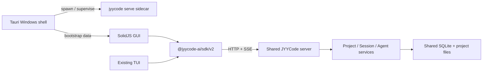
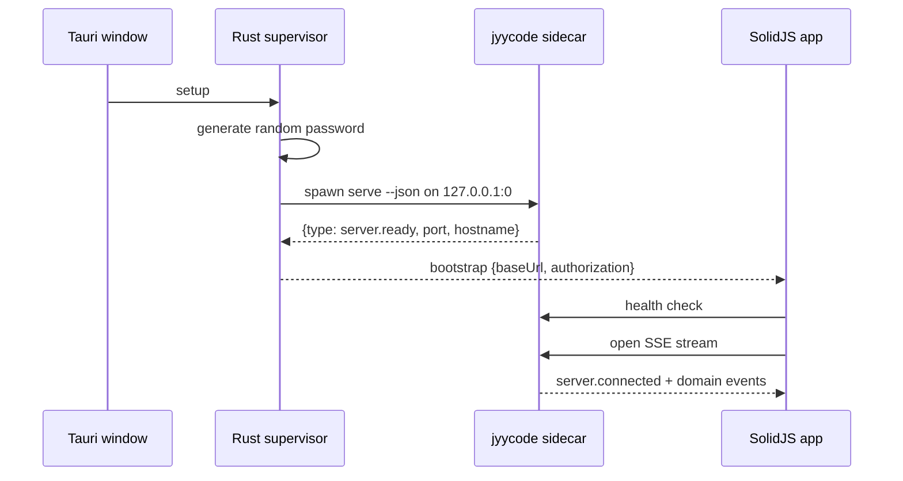

# JYYCode Windows 桌面 GUI 第一阶段设计

**状态：** 已确认  
**日期：** 2026-07-12  
**目标平台：** Windows 10/11 x64  
**技术路线：** Tauri 2 + SolidJS + JYYCode sidecar

## 1. 目标

为 JYYCode 提供一个简约、美观的 Windows 桌面应用。第一阶段交付项目创建与打开、Session 管理，以及可在应用重启后恢复的单 Agent 持续对话。

桌面 GUI 和现有 TUI 必须共享同一套后端服务、SQLite 数据、HTTP API、生成 SDK 与 SSE 事件协议。GUI 不复制 Session、Agent、权限或消息处理业务。

## 2. 第一阶段范围

### 2.1 包含

- 打开现有本地目录。
- 新建空目录，并可选调用后端初始化 Git。
- 保存和重新打开最近项目。
- 新建、恢复、重命名、归档和删除根 Session。
- 选择后端已有的 Agent、Provider 和模型。
- 发送消息、流式显示响应、停止生成和失败重试。
- 显示文本、思考过程和工具调用状态。
- 处理权限请求和 Agent 问题。
- 应用重启后恢复最近项目、Session、消息和运行状态。
- 生成 Windows 安装程序和便携构建产物。

### 2.2 不包含

- Multi-Agent 和 Agent Cluster 面板。
- 子 Session、会话分支与时间线 Fork。
- 分享、导出、压缩、Undo/Redo。
- 内置终端、文件树、Diff 编辑器和代码编辑器。
- 项目模板、Git Clone 和 worktree 管理。
- macOS、Linux 和移动端打包。
- 自动更新、系统托盘和云端账户体系。

## 3. 需求摘要

### 3.1 功能需求

1. 用户安装后无需另行安装或启动 JYYCode CLI。
2. 用户可从系统目录选择器打开项目，或在选定父目录下创建新项目。
3. 项目被选择后，GUI 通过目录上下文访问现有 Project、Session 和配置 API。
4. Session 和消息以服务端为唯一事实来源。
5. 流式事件中断后可以自动重连，并通过重新拉取快照恢复一致状态。
6. 关闭桌面应用时不会留下孤立 sidecar 进程，也不会破坏正在落盘的数据。

### 3.2 非功能需求

- **启动：** 常规机器冷启动到可交互欢迎页目标不超过 3 秒；数据库首次迁移可显示独立进度。
- **交互：** 本地操作在 100ms 内给出视觉反馈；流式文本以最多每帧一次的频率批量刷新。
- **可靠性：** 不在 GUI 保存消息副本；断线恢复后以服务端快照覆盖缓存。
- **安全：** 后端仅绑定 `127.0.0.1`；每次应用启动生成随机密码；WebView 只获得最小 Tauri capability。
- **可访问性：** 目标为 WCAG 2.2 AA；完整键盘操作、可见焦点、语义化控件、4.5:1 正文对比度，并尊重 `prefers-reduced-motion`。
- **可维护性：** GUI 只通过 `@jyycode-ai/sdk/v2` 访问业务功能；禁止直接导入 `packages/jyycode/src/session` 等内部模块。

## 4. 高层架构

新增两个包：

- `packages/app`：纯 SolidJS GUI，可由 Vite 独立构建。仓库现有 JYYCode 构建脚本已经识别该路径并支持把其 `dist` 嵌入 CLI。
- `packages/desktop`：Tauri 壳、Windows 配置、sidecar 生命周期和系统目录操作。它加载 `packages/app/dist`，不包含业务状态实现。

现有 `packages/jyycode` 继续拥有全部后端业务。唯一需要增加的后端能力是 `jyycode serve --json` 机器可读握手，用于报告实际监听地址；该能力仍属于通用 headless server，而不是 GUI 专用业务分支。

## 5. 关键架构决策

### ADR-001：采用 Tauri 2，而不是 Electron

**状态：** Accepted

**背景：** Windows 桌面端需要轻量安装包、较低常驻内存和可靠的 sidecar 管理。仓库历史中曾存在 Electron GUI，但已经删除，且不应恢复两套桌面技术。

**决策：** 使用 Tauri 2 承载 SolidJS 前端，把现有 Bun 编译产物作为 external binary sidecar。

**正面影响：** 安装包和运行时开销较低；Windows WebView2 由系统或安装器管理；Rust 层可以安全地拥有进程句柄。

**负面影响：** 构建机需要 Rust/MSVC/WiX 或 NSIS 工具链；团队需要维护少量 Rust 代码。

**备选方案：** Electron 开发路径熟悉，但运行时和安装体积更大；自研 WebView 壳会增加生命周期、更新和安全维护成本。

### ADR-002：GUI 通过 SDK/API 共享后端

**状态：** Accepted

**背景：** “与 TUI 完全共享后端”要求防止业务逻辑在客户端分叉。

**决策：** GUI 仅使用 `@jyycode-ai/sdk/v2`、HTTP API 和 SSE。项目、Session、消息、权限和 Agent 逻辑保留在服务端。GUI 只维护服务端缓存、当前选中项和未发送输入。

**正面影响：** TUI 与 GUI 共享修复、数据库和行为；API 契约可独立测试。

**负面影响：** GUI 必须处理服务启动、断线和事件一致性；不能直接调用后端内部函数走捷径。

### ADR-003：拆分 `packages/app` 与 `packages/desktop`

**状态：** Accepted

**背景：** 仓库的二进制构建已经预留 `packages/app/dist` 嵌入入口，而 Tauri 配置不应污染纯 GUI 组件。

**决策：** SolidJS 应用放在 `packages/app`，Tauri Rust 壳放在 `packages/desktop`。

**正面影响：** GUI 可在浏览器测试；现有 `jyycode web` 也能复用同一构建产物；桌面系统能力保持在窄边界内。

**负面影响：** 开发脚本需要协调两个包；桌面 bootstrap 必须有浏览器测试替身。

### ADR-004：sidecar 由 Rust 层拥有

**状态：** Accepted

**背景：** 若 WebView 直接获得任意 shell 执行权限，前端漏洞会扩大为本地命令执行风险。

**决策：** Rust setup 阶段使用固定 external binary 名称启动 sidecar，只允许固定的 `serve --json --hostname 127.0.0.1 --port 0` 参数。随机认证密码通过环境变量传入。前端只能查询 bootstrap 状态或请求受控重启。

**正面影响：** 最小 capability；进程句柄、stdout 握手、退出清理集中管理。

**负面影响：** Rust 层需要实现超时、日志缓冲和一次性重启策略。

## 6. 启动与进程生命周期

握手超时或 sidecar 在 ready 前退出时，桌面端显示诊断页。运行期间 sidecar 意外退出，Rust 层只自动重启一次；成功后 GUI 清空请求缓存并重新同步当前项目与 Session。再次失败则停止自动尝试。

窗口关闭时先停止接收新提交，取消 SSE，再请求 sidecar 优雅退出；超过短超时后强制终止进程树。认证密码只存在于当前进程内存和子进程环境中，不写入 Tauri Store 或日志。

## 7. 数据与状态模型

### 7.1 服务端状态

- Project、Session、Message、Part、SessionStatus。
- Agent、Provider、Model 与 Config。
- PermissionRequest、QuestionRequest。
- 所有持久化数据和运行状态。

### 7.2 桌面偏好

- 最近项目绝对路径，按最近使用时间排序并限制数量。
- 最后打开的项目路径与 Session ID。
- 左栏折叠状态和思考过程展开偏好。

桌面偏好保存在 Tauri Store，不包含消息、API 密钥或认证密码。

### 7.3 GUI 缓存

TanStack Solid Query 管理服务端快照。SSE bridge 将域事件批量合并到 Query Cache；事件无法安全增量应用时，使相应 query 失效并重新拉取。项目切换使用目录作为所有 query key 的一部分，防止跨项目缓存污染。

## 8. 核心流程

### 8.1 打开项目

1. 使用系统目录选择器返回绝对路径。
2. 使用该目录创建带目录上下文的 SDK 客户端。
3. 调用 `project.current`、配置、Agent/Provider 和 Session 列表接口。
4. 成功后写入最近项目；失败则保留欢迎页并显示就地错误。

### 8.2 新建项目

1. 用户选择父目录、输入项目名称并选择是否初始化 Git。
2. Rust command 校验名称，确保目标位于选定父目录内且不存在，然后创建一个空目录。
3. GUI 以新目录建立项目上下文。
4. 若启用 Git，调用 `project.initGit`，不在 Rust 层执行 Git 命令。
5. 创建首个 Session 并进入对话页。

### 8.3 Session 管理

- 列表默认只显示当前项目的非归档根 Session，并按更新时间降序排列。
- 新建使用 `session.create`，显式传入 Agent、模型和 `multiAgent: false`。
- 重命名和归档使用 `session.update`。
- 删除必须二次确认，成功后导航到下一 Session 或空状态。
- 归档列表通过单独筛选器加载，不与普通列表混排。

### 8.4 单 Agent 对话

1. Composer 校验非空输入、当前 Agent 和模型。
2. 使用 `session.promptAsync` 提交，并防止重复发送。
3. 通过 `message.updated`、`message.part.updated` 与 `message.part.delta` 渲染流式内容。
4. `session.status` 非 idle 时把发送按钮切换为停止按钮，停止调用 `session.abort`。
5. 权限请求和 Agent 问题固定显示在 Composer 上方，直到后端确认处理。
6. 重试复用失败的用户输入重新调用 Prompt，不伪造或本地持久化 assistant 消息。

## 9. 信息架构与视觉系统

### 9.1 布局

主窗口采用双栏布局：

- 左栏约 280px：项目切换器、Session 新建与筛选、Session 列表、连接状态和设置入口。
- 主区：Session 标题栏、消息时间线、权限/问题区域和 Composer。

欢迎页提供“打开现有目录”和“新建项目”两个主动作。窄窗口可折叠左栏，但不进行移动端适配。

### 9.2 设计令牌

| 角色 | Token | 值 |
| --- | --- | --- |
| 应用背景 | `--color-bg` | `#07111F` |
| 面板背景 | `--color-panel` | `#0B192B` |
| 抬升表面 | `--color-surface` | `#10243A` |
| 翠绿主色 | `--color-accent` | `#22C997` |
| 主色悬浮 | `--color-accent-hover` | `#36D9AA` |
| 主文字 | `--color-text` | `#E7EEF7` |
| 次文字 | `--color-text-muted` | `#8DA2B8` |
| 边框 | `--color-border` | `#1A3148` |
| 危险 | `--color-danger` | `#F87171` |
| 警告 | `--color-warning` | `#FBBF24` |

间距使用 4px 基准：`4, 8, 12, 16, 24, 32, 48`。圆角使用 `6, 8, 12px`。交互动效为 120–180ms，进入使用 ease-out，退出使用 ease-in；减少动态偏好下关闭非必要动画。

UI 字体使用 Inter，并提供 `Segoe UI, system-ui, sans-serif` 本地回退；代码和工具输出使用 JetBrains Mono，并提供 `Cascadia Mono, Consolas, monospace` 回退。第一阶段字体随应用打包，避免网络字体与布局跳动。

### 9.3 消息呈现

- 用户消息使用低对比表面容器。
- Agent 输出直接排版在内容流中，不使用大号聊天气泡。
- 思考过程默认折叠并明确标注。
- 工具调用使用紧凑状态卡，状态不能只依赖颜色。
- 所有 icon-only 按钮使用同一 SVG 图标集并提供 accessible name。

## 10. 组件边界

- `DesktopBootstrapProvider`：获取后端地址、认证信息和进程状态。
- `SdkProvider`：按 base URL、认证和目录创建 SDK 客户端。
- `EventBridge`：订阅 SSE、批量处理事件和触发重同步。
- `ProjectSwitcher`、`RecentProjects`、`ProjectCreateDialog`。
- `SessionList`、`SessionListItem`、`SessionActions`。
- `ConversationView`、`MessageTimeline`、`MessagePartRenderer`。
- `TextPart`、`ReasoningPart`、`ToolCallCard`。
- `PermissionBar`、`QuestionPanel`、`Composer`。
- `BackendUnavailable`、`ReconnectBanner`、`EmptyState` 和 `InlineError`。

组件不得直接读取 Tauri Store、直接调用 `fetch` 或导入后端内部模块。页面通过 feature-level query/mutation hooks 与平台 adapter 组合这些组件。

## 11. 错误处理

| 故障 | 用户影响 | 恢复策略 |
| --- | --- | --- |
| sidecar 启动失败 | 无法进入主界面 | 显示日志位置和受控重启 |
| 握手超时 | 后端地址未知 | 终止进程，显示诊断页 |
| sidecar 运行时退出 | 当前连接中断 | 自动重启一次，重建 SDK 与缓存 |
| SSE 断线 | 流式状态可能滞后 | 显示重连横幅，指数退避，成功后全量同步 |
| 项目创建失败 | 项目未建立 | 保留表单内容，就地显示原因 |
| Session mutation 失败 | 列表状态未改变 | 不做不可逆乐观更新，恢复操作按钮 |
| Prompt 提交失败 | 消息未发送 | 保留输入并提供重试 |
| 权限/问题回复失败 | Agent 继续等待 | 保持请求卡可见并允许再次提交 |

## 12. 测试策略

- **后端契约测试：** `serve --json`、认证、Tauri origin CORS、项目 API、Session API 与 SSE。
- **状态单元测试：** query key、事件归并、乱序/重复 delta、重连失效和 Session 排序。
- **Solid 组件测试：** 使用 Vitest、jsdom、Solid Testing Library 和 user-event，优先按 role/label 查询。
- **应用集成测试：** 使用真实 `Server.Default().app` 或测试 listener，覆盖项目打开到恢复对话。
- **Rust 测试：** 项目路径校验、握手解析、超时、进程退出状态机和日志脱敏。
- **Windows 冒烟测试：** 安装、首次启动、WebView2、sidecar 启停、目录选择、单实例和卸载。
- **视觉验收：** 100%、125%、150% DPI；1024x720、1440x900 和 4K；键盘焦点、滚动、长路径和中英文混排。

## 13. 第一阶段验收标准

1. Windows 用户安装后无需额外安装 Bun、Node.js 或 JYYCode CLI。
2. GUI 与 TUI 能打开同一项目，并看到相同 Session 和消息。
3. 用户可创建/打开项目、初始化 Git、管理 Session，并完成连续单 Agent 对话。
4. 文本、思考和工具调用能随 SSE 实时更新；权限和问题交互可完成闭环。
5. 断开 SSE 或重启桌面应用后，状态能从后端恢复且不产生重复消息。
6. 关闭应用后没有残留 sidecar 进程。
7. 正常正文与控件满足 WCAG AA 对比度，所有核心操作可仅用键盘完成。
8. `bun turbo typecheck`、后端相关 Bun tests、GUI Vitest、Rust tests 和 Windows 冒烟测试全部通过。

## 14. 风险与缓解

- **Bun 单文件产物作为 Tauri sidecar 的命名和打包差异：** 用独立 staging 脚本生成 Tauri target-triple 文件名，并在 CI 校验哈希和 `--version`。
- **SSE 高频 delta 导致 WebView 重绘：** 按 animation frame 批量应用 delta，并限制只更新受影响 query。
- **后端进程崩溃造成重复启动：** Rust supervisor 持有唯一 child 句柄，并使用显式状态机和一次重启上限。
- **随机本地端口被其他进程占用：** 让现有 server 使用 `port: 0` 并通过 ready 握手返回实际端口。
- **WebView 前端漏洞扩大权限：** 不给前端任意 shell 或文件系统 capability；自定义 Rust command 只暴露窄操作；CSP 只允许本地资源和当前后端地址。
- **历史 Electron GUI 诱发直接恢复旧代码：** 新实现从空的 Tauri/Solid 骨架开始，只参考仍有效的 SDK/API 契约。

## 15. 官方参考

- [Tauri：嵌入 external binaries/sidecar](https://v2.tauri.app/develop/sidecar/)
- [Tauri：Capabilities 与安全边界](https://v2.tauri.app/security/capabilities/)
- [Tauri：Windows installer 与 WebView2](https://v2.tauri.app/distribute/windows-installer/)
- [SolidJS：官方测试指南](https://docs.solidjs.com/guides/testing)
- [TanStack Solid Query：Quick Start](https://tanstack.com/query/latest/docs/framework/solid/quick-start)

